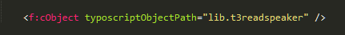
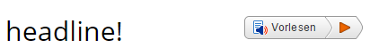
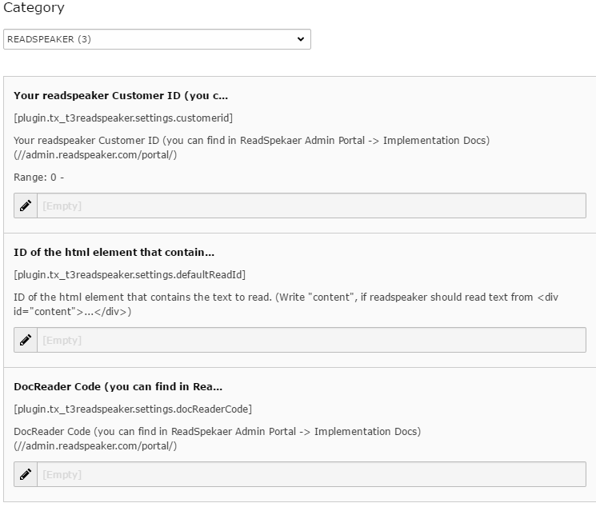

.. ==================================================
.. FOR YOUR INFORMATION
.. --------------------------------------------------
.. -*- coding: utf-8 -*- with BOM.

.. include:: ../Includes.txt

.. _introduction:

Introduction
============

.. _what-it-does:

What does it do?
----------------

Will add the ReadSpeaker Service to your website. Easy to use, multi language and many voice options.

Watch the ReadSpeaker webReader introduction video: https://www.youtube.com/watch?v=zMtpLuOJ3m8&feature=youtu.be

.. _screenshots:

Screenshots
-----------

Fluid usage

   Fluid template usage

Frontend reading

.. figure:: ../Images/rsreading.png
   :width: 689px
   :alt: ReadSpeaker reading text

   ReadSpeaker reading text

Frontend closed

   ReadSpeaker Button

.. _installation:

Installation
------------

#. Install this extension
#. Set your rs customer ID and CSS ID in the CONSTANT EDITOR
#. Add this code, where the readspeaker button should appear: <f:cObject typoscriptObjectPath="lib.t3readspeaker" />
#. Choose a language and a voice in your root page properties.

.. tip::

   Try the fluid inline style: {f:cObject(typoscriptObjectPath:'lib.t3readspeaker')}

Constant Editor

   ReadSpeaker Settings

   Set your "customer id", your "docreader id" and the "css read id"

